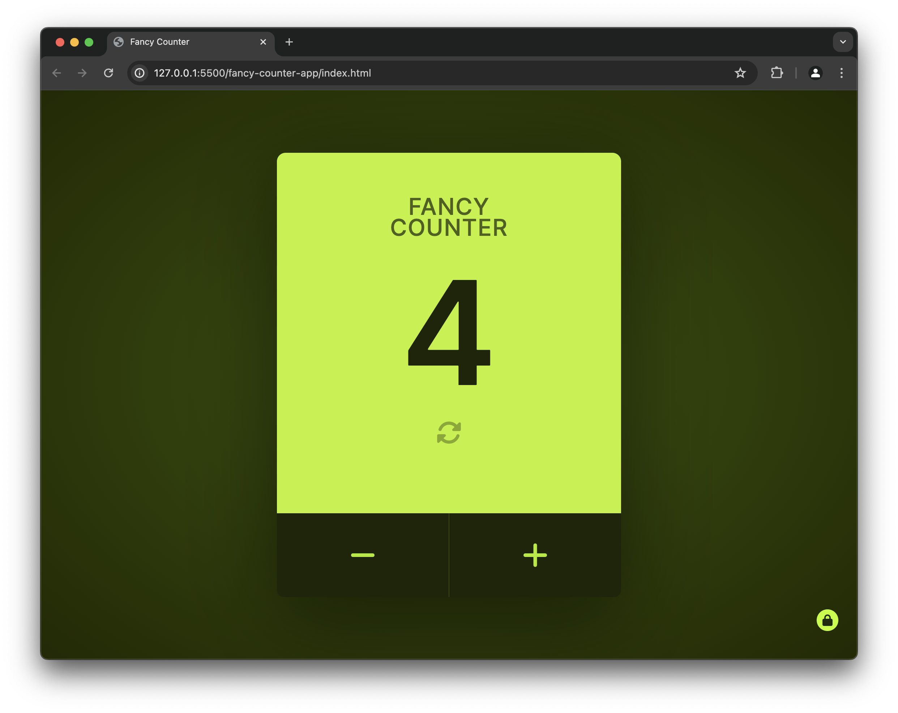

# Fancy Counter App Exercise

This project is part of [Byte Grad's](https://bytegrad.com/) Javascript course that I made some changes to. Specifically, I added the ability to "unlock" PRO mode by selecting the lock icon at the bottom to get past this limit

## How to Use

Download the app with he folder and open the HTML page with the browser of your choice. There is a 5 count limit, but to get past that, select the lock icon in the bottom left.

You can increment the counter by hitting the "+" icon. Decrement with the "-" icon. The counter can be reset with the button below the current count. You can also increment using any key on the keyboard.

## Things to Improve

There are some areas where I think this app can be improved. If I have time, I may go back and add these:

- Accessability. I want to test and make sure this is usable in a variety of scenarios. I think it could be a good test bed to learn on.
- Responsive behavior. There is some, but I think it can handle certain screen sizes better
- Better handling of "PRO" toggling. Specifically, be able to get PRO once you hit the limit and continue.
